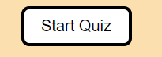
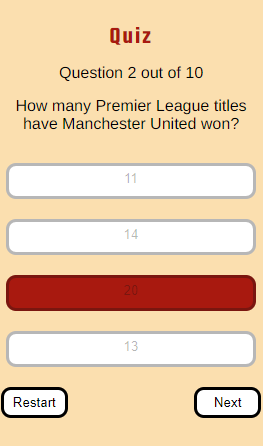
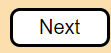
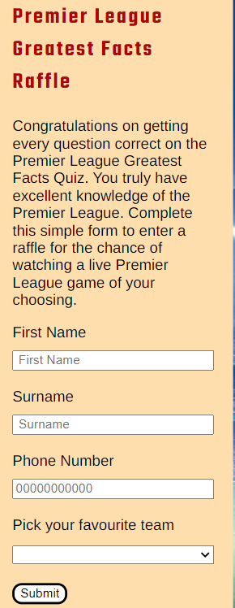

# Premier League Greatest Facts 

Premier League greatest facts is a quiz designed around the best league in the world the Premier League this quiz will test the knowledge of the users with questions of increasing difficulty as the user progresses through.

## CONTENTS

- [Premier League Greatest Facts](#premier-league-greatest-facts)
  - [CONTENTS](#contents)
  - [Project Goals](#project-goals)
    - [Client Goals](#client-goals)
    - [User Goals](#user-goals)
    - [Frequent user goals](#frequent-user-goals)
    - [Future Implementations](#future-implementations)
  - [Design](#design)
  - [Typography](#typography)
    - [Headings](#headings)
    - [Body](#body)
    - [Wireframes](#wireframes)
      - [Mobile](#mobile)
      - [Desktop](#desktop)
  - [Key Features](#key-features)
    - [Favicon](#favicon)
      - [Favicon Mobile](#favicon-mobile)
      - [Favicon Desktop](#favicon-desktop)
    - [Questions](#questions)
      - [Questions Mobile view](#questions-mobile-view)
      - [Questions Desktop view](#questions-desktop-view)
    - [Instructions](#instructions)
      - [Instructions Mobile view](#instructions-mobile-view)
      - [Instructions Desktop view](#instructions-desktop-view)
    - [Play button](#play-button)
      - [Play button Mobile view](#play-button-mobile-view)
      - [Play button Desktop view](#play-button-desktop-view)
    - [Answers](#answers)
      - [Answers Mobile view](#answers-mobile-view)
      - [Answers Desktop View](#answers-desktop-view)
    - [Correct and wrong answers](#correct-and-wrong-answers)
      - [Mobile view correct and wrong answers](#mobile-view-correct-and-wrong-answers)
      - [Desktop view correct and wrong answers](#desktop-view-correct-and-wrong-answers)
    - [Next  button](#next--button)
      - [Mobile next button view](#mobile-next-button-view)
      - [Desktop next  button view](#desktop-next--button-view)
    - [Contact page](#contact-page)
      - [Mobile view contact page](#mobile-view-contact-page)
      - [Desktop view contact page](#desktop-view-contact-page)
    - [Error 404 page](#error-404-page)
      - [Mobile view error page view](#mobile-view-error-page-view)
      - [Desktop view error page view](#desktop-view-error-page-view)
  - [Accessibilty](#accessibilty)
  - [Technology](#technology)
    - [Languages](#languages)
    - [Frameworks \& Tools](#frameworks--tools)
  - [Deployment](#deployment)
    - [How to deploy](#how-to-deploy)
    - [Local Deployment](#local-deployment)
      - [How to Fork](#how-to-fork)
      - [How to clone](#how-to-clone)
  - [Testing](#testing)
    - [Solved Bugs](#solved-bugs)
  - [Credits](#credits)
    - [Media](#media)
      - [Imagery](#imagery)
      - [Code](#code)
      - [Content](#content)
    - [Acknowledgements](#acknowledgements)

## Project Goals

### Client Goals

* Build a responsive quiz for all screen sizes
* The objective and purpose behind the quiz is evident upon loading the webpage
* Quiz allows future users to go again and recieve a higher score increasing the attention the website gains.

### User Goals 

* Test knowledge to prove how much they know.
* Learn information and facts they didnt quite know.
* Be able to view instructions which explains how the quiz works
* Be able to skip certain questions and go back if they would like to attempt certain questions again.
  

### Frequent user goals 

* Attempt Quiz again to beat high score 
* Attempt to get every question correct to enter raffle.
* Complete contact form to enter raffle. 

### Future Implementations

* Aim to add a timer.
* Aim to add questions which only include images instead of text.
* Keep track of highest scores and usernames.
  

## Design

## Typography

### Headings 

### Body

### Wireframes 

#### Mobile 

* This is a wireframe of the mobile version of the quiz
  

#### Desktop

* This is a wireframe of the desktop version of the quiz.

## Key Features 

### Favicon

#### Favicon Mobile

#### Favicon Desktop

### Questions 

* This element will be generated by the javascript object question where these questions will gradually increase in difficulty for users allowing new users to start the quiz gradually to not deter newer users from taking part.

#### Questions Mobile view

#### Questions Desktop view

### Instructions

* This element will be generated when clicking on the instructions button this will be done by using the class list to add class and the remove class by using two functions to trigger the hide and show elements. Allowing the user to view the insturctions first will allow users to understand what they need to do before starting the quiz welcoming new users not detering them.

#### Instructions Mobile view 

#### Instructions Desktop view

### Play button 

* This element will allow users to decide when they would like to start the quiz, rather than the first question loading upon opening the website, this allows users to take there time, will not force users to start the quiz straight away.

#### Play button Mobile view

#### Play button Desktop view

### Answers 

* This element is the main purpose of the quiz the answer these will be shuffled to make sure answers are not in the same place as they were orginally upon trying the quiz again. These answers will be generated by the anwers object which is a child of the questions object and will be generated by the function showAnswer().

#### Answers Mobile view

#### Answers Desktop View

### Correct and wrong answers 

* This element will be the main purpose behind the quiz will give users a visual que showing them if they got the answers correct or wrong which will be kept track of and trigged by javascript.

#### Mobile view correct and wrong answers

#### Desktop view correct and wrong answers 

### Next  button

* This element will allow the user to progress to the next question and will only show up when the question has been answered allowing the user to take there time with answering the questions.

#### Mobile next button view

#### Desktop next  button view

### Contact page

* This element wil be shown to users if they get every question correct, this contact page will allow the user via a drop down to select there favourite team enter there email and first and surname as well once submitting this form it will load an extra page thanking the user for there participation in the quiz, while also entering them into a raffel for a chance to visit a live Premier league game of there choosing.

#### Mobile view contact page

#### Desktop view contact page 

### Error 404 page

* This will be an extra page with the same style as the rest of the quiz, this page will only be used if the page does not exist, git hub will find this page instead of the standard page created by git hub themselves

#### Mobile view error page view

#### Desktop view error page view 

## Accessibilty 

## Technology 

### Languages

* HTML
* CSS
* JavaScript

### Frameworks & Tools 

- [Git Hub](https://github.com/)
- [Git](https://git-scm.com/)
- [Font awesome](https://fontawesome.com/)
- [Google Fonts](https://fonts.google.com)
- [Code Anywhere](https://codeanywhere.com/solutions/collaborate)
- [Favicon](https://favicon.io/favicon-generator/)
- [Chrome Dev Tools](https://developer.chrome.com/docs/devtools/)
- [Tiny PNG](https://tinypng.com/)
- [W3C HTML Validator](https://validator.w3.org/)
- [W3C CSS Validator](https://jigsaw.w3.org/css-validator/)
- [Wave accessibility evaluation tools](https://wave.webaim.org/)
- [Coolors](https://coolors.co/)
- [Contrast Grid](https://contrast-grid.eightshapes.com/?version=1.1.0&background-colors=&foreground-colors=%23FFFFFF%2C%20White%0D%0A%23F2F2F2%0D%0A%23DDDDDD%0D%0A%23CCCCCC%0D%0A%23888888%0D%0A%23404040%2C%20Charcoal%0D%0A%23000000%2C%20Black%0D%0A%232F78C5%2C%20Effective%20on%20Extremes%0D%0A%230F60B6%2C%20Effective%20on%20Lights%0D%0A%23398EEA%2C%20Ineffective%0D%0A&es-color-form__tile-size=compact&es-color-form__show-contrast=aaa&es-color-form__show-contrast=aa&es-color-form__show-contrast=aa18&es-color-form__show-contrast=dnp)
- [Am I responsive](https://ui.dev/amiresponsive)
- [Convertio](https://convertio.co/)
- [FLighthouse](https://developer.chrome.com/docs/lighthouse/overview/)

## Deployment 

### How to deploy 

This site is deployed using GitHub Pages - [Premier-Quiz](https://github.com/mattthughes/premier-quiz)

To deploy the site using GitHub Pages follow the following steps:

1. Login or signup to GitHub.
2. Go to the repository for this project [mattthughes/premier-quiz](https://github.com/mattthughes/premier-quiz)
3. Click the settings button.
4. Select pages in the left hand navigation menu.
5. From the source dropdown select main branch changing this from root to main and then press save.
6. After this step the site has now been deployed, this can take a few minutes for the site to become avaliable to view, this will allow you to see your changes on the deployed site.

### Local Deployment 

#### How to Fork

1. Log in or sign up to GitHub.
2. Go to the repository for this project [mattthughes/premier-quiz](https://github.com/mattthughes/premier-quiz)
3. Click the Fork button on the top right corner to fork the project.

#### How to clone

1. Log in or sign up to GitHub.
2. Go to the repository for this project [mattthughes/premier-quiz](https://github.com/mattthughes/premier-quiz)
3. Click on the code button and select whether you would like to clone with HTTPS,SSH or GitHub Cli and copy the link shown.
4. Next open the terminal in the code editor and change the current working directory to the location you want to use for the cloned directory
5. Type 'git clone' into the terminal and paste the copied links and press enter.

## Testing

### Solved Bugs

* Fixed the class add issue, to fix this I created a second function called hideElements and added the hide class from the css and then added the class list add class to the show instructions function which was labelled as show changing the element from display none to display block to show the instructions.
* Fixed the issue where the footer would not stick to the bottom of the page, in order to fix this I changed the values min-height and added display flex and flex direction elements, this adjusted the main content to take up all the extra space, I also added the flex-grow property to make sure this was consistent on all screen sizes, I then added the margin-top auto style to make sure the footer stayed at the bottom of the page.
- There was an issue where the background Image would show unnessary white space when clicking the instructions button. In order to fix this I adjusted the larger padding and margin values on the instrutions window, doing this along with the fixed footer bug fix solved this issue.
- Button Elements were not centering on Tablets and Desktop screen sizes in order to fix this I added the property display flex, flex-direction column to the parent element and then used the align self element on the start and instructions button, aligning them to the center which fixed this issue.
- Fixed a bug where the instructions were visible after pressing the start button while viewing the instructions, in order to fix this I added the hide instructions function to the run game function which fixed this issue.
- Solved bugs with the quiz background this was not displaying correctly because of the height vh value removed the height value to fix this issue.
- Solved issue where there was a type error regarding the keyword question stating the value was undefined and was also trying to be used before initialisation in order to fix this initalised value outside the function declaration.
- Fixed the bug regarding duplicate answers from the runGame function in order to fix this I added a reset state function which hid the next button and used a while loop to remove the first child when it was active in the while loop.
- Fixed bug with answers not being answered correctly by changing answers.iscorrect to answers.correct which ended up the questions showing correctly.
- Fixed a bug where the questions were being repeated added new function show results with the reset state function included in this function.
- Fixed score bug which was not displaying correctly on the show results page in order to fix this I changed the template literal from questions to questions.length which got the length of the array fixing this issue.
- Fixed issue regarding correct answers when loading the quiz all questions were highlighted in green, not allowing the user to answer or go to the next question in order to fix this, I changed where the function was placed and instead placed this in the select answer function, currently this function is showing the correct answers after, I will look to refactor this function to remove this element.
- Fixed question and answer display bug by adding a curly bracket in between the for each statement and the event listener for the next button, I also removed the display correct answer part and just used button disabled instead which fixed this issue.
- Fixed issue with contact form that wasnt displaying the correct behaviour with the thankyou.html file, when pressing start the questions would not appear in order to fix this I removed the thankyou.html page and added in the event.preventDefault function to the raffle end function, which made the questions appear and removed the data from the url when submitting the form which fixed this issue.
- The data itself was not being capturned and instead was capturing the name of the html object rather than the data the user inputted, in order to fix this I added on the id name and the . value to get the data the user inputted which fixed this issue.
- Fixed an issue with raffle showing at the beginning of the quiz, to fix this I added classlist hide to the hide instructions function, added the show class to the raffle end function to fix this issue.
- Fixed an issue regarding the result screen not showing if the users score was 9 adding the less than or equal to symbol to the if statement to fix this issue.
- Fixed an HTML issue regarding the favourite team input option by removing the required attribute.
- Fixed an issue regarding the contact form by adding in the handle event function, originally the form could be submitted without filling in the correct information, which was not the original planned outcome, the handle event function fixed this by sending an alert to the user if the information hadnt been completed as required. Once all the inputs were filled out the submit button would add an event listener taking the user to the thank you message screen.
- Fixed HTML error by removing placeholder text for the favourite team select option.
- Fixed HTML error for phone input by changing label to match input id.
- Fixed HTML errors by changing section elements to div elements that do not require titles.
- Fixed CSS Header issue by aligning the footer to the left, otherwise the footer would not stay consistent with the raffle and questions aligning the footer to the left fixed this issue.
- Fixed thank you section bug, after the user pressed the go back button this would result in the run game function being loaded when the user next pressed the next button, this would instantly take the user to the form, section to fix this I added the remove event listener method removing the join raffle function from the next button and only adding this once the user has answered every question.

## Credits 

### Media 

#### Imagery 

#### Code

#### Content

### Acknowledgements 

