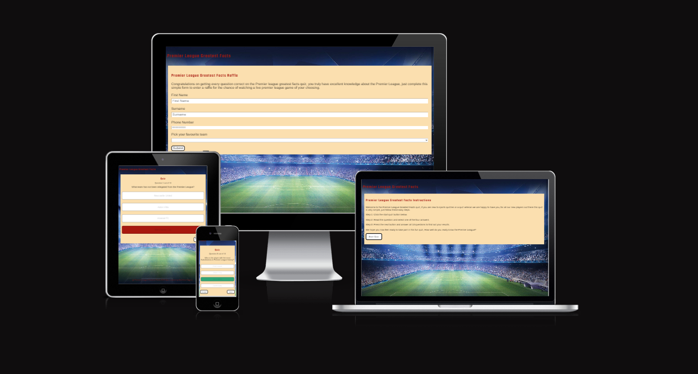
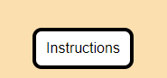
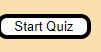
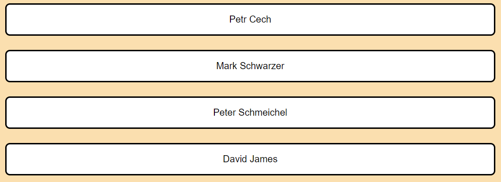
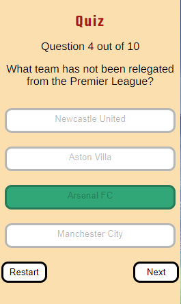
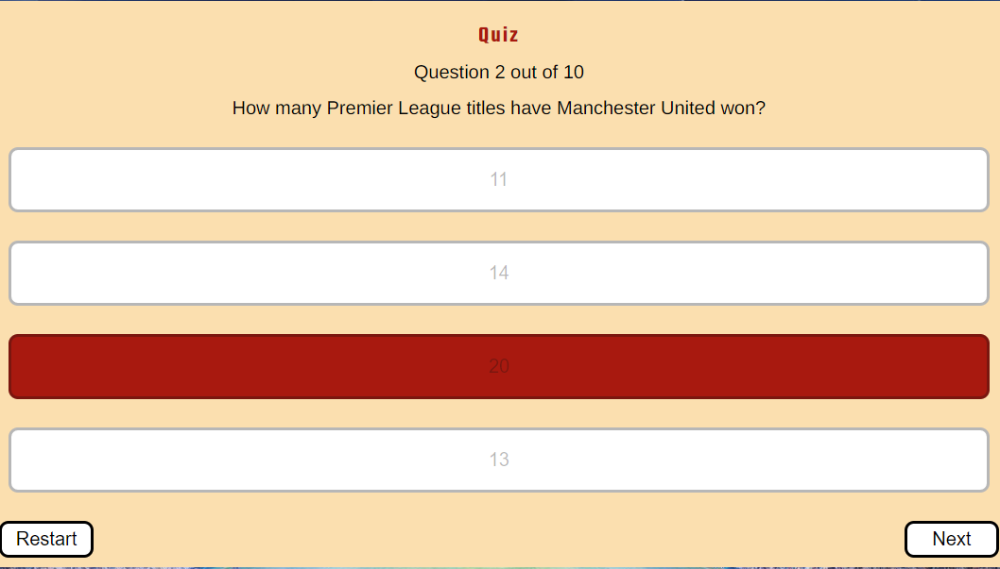
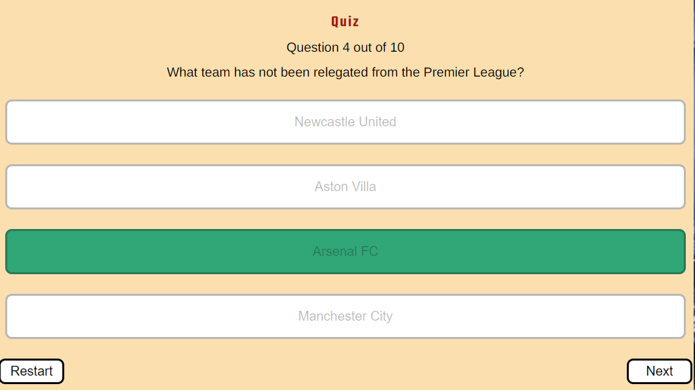
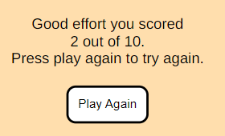
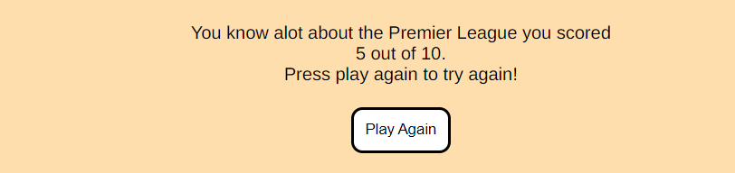
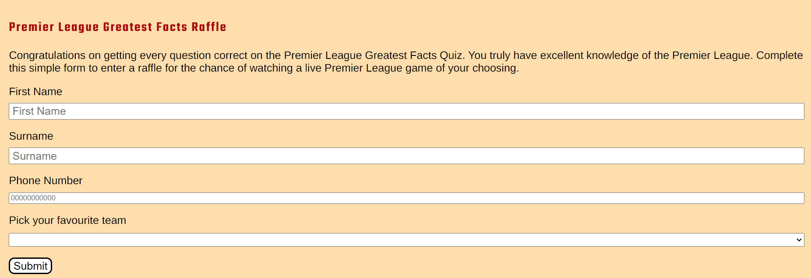

# Premier League Greatest Facts 

Premier League greatest facts is a quiz designed around the best league in the world the Premier League this quiz will test the knowledge of the users with questions of increasing difficulty as the user progresses through.

## CONTENTS

- [Premier League Greatest Facts](#premier-league-greatest-facts)
  - [CONTENTS](#contents)
  - [Project Goals](#project-goals)
    - [Client Goals](#client-goals)
    - [User Goals](#user-goals)
    - [Frequent user goals](#frequent-user-goals)
    - [Future Implementations](#future-implementations)
  - [Design](#design)
  - [Colour Palette](#colour-palette)
  - [Typography](#typography)
    - [Headings](#headings)
    - [Body](#body)
    - [Wireframes](#wireframes)
      - [Mobile](#mobile)
      - [Desktop](#desktop)
  - [Key Features](#key-features)
    - [Favicon](#favicon)
    - [Questions](#questions)
      - [Questions Mobile view](#questions-mobile-view)
      - [Questions Desktop view](#questions-desktop-view)
    - [Instructions](#instructions)
      - [Instructions Mobile view](#instructions-mobile-view)
      - [Instructions Desktop view](#instructions-desktop-view)
    - [Play button](#play-button)
      - [Play button Mobile view](#play-button-mobile-view)
      - [Play button Desktop view](#play-button-desktop-view)
    - [Answers](#answers)
      - [Answers Mobile view](#answers-mobile-view)
      - [Answers Desktop View](#answers-desktop-view)
    - [Correct and wrong answers](#correct-and-wrong-answers)
      - [Mobile view correct and wrong answers](#mobile-view-correct-and-wrong-answers)
      - [Correct Answers](#correct-answers)
      - [Wrong Answers](#wrong-answers)
      - [Desktop view correct and wrong answers](#desktop-view-correct-and-wrong-answers)
      - [Correct Answers](#correct-answers-1)
      - [Wrong Answers](#wrong-answers-1)
    - [Next  button](#next--button)
      - [Mobile next button view](#mobile-next-button-view)
      - [Desktop next  button view](#desktop-next--button-view)
    - [Results screen](#results-screen)
      - [Mobile less than 3 score](#mobile-less-than-3-score)
      - [Mobile less than or 9 score](#mobile-less-than-or-9-score)
      - [Mobile all questions correct](#mobile-all-questions-correct)
      - [Desktop less than 3 score](#desktop-less-than-3-score)
      - [Desktop less than or 9 score](#desktop-less-than-or-9-score)
      - [Desktop all questions correct](#desktop-all-questions-correct)
    - [Contact page](#contact-page)
      - [Mobile view contact page](#mobile-view-contact-page)
      - [Desktop view contact page](#desktop-view-contact-page)
    - [Thank you Page](#thank-you-page)
      - [Mobile View Thank you page](#mobile-view-thank-you-page)
      - [Desktop view Thank you page](#desktop-view-thank-you-page)
    - [Error 404 page](#error-404-page)
      - [Mobile view error page view](#mobile-view-error-page-view)
      - [Desktop view error page view](#desktop-view-error-page-view)
  - [Accessibilty](#accessibilty)
  - [Technology](#technology)
    - [Languages](#languages)
    - [Frameworks \& Tools](#frameworks--tools)
  - [Deployment](#deployment)
    - [How to deploy](#how-to-deploy)
    - [Local Deployment](#local-deployment)
      - [How to Fork](#how-to-fork)
      - [How to clone](#how-to-clone)
  - [Testing](#testing)
  - [Credits](#credits)
    - [Media](#media)
      - [Imagery](#imagery)
      - [Code](#code)
      - [Content](#content)
    - [Acknowledgements](#acknowledgements)

[Live Project](https://mattthughes.github.io/premier-quiz/)

## Project Goals

### Client Goals

* Build a responsive quiz for all screen sizes
* The objective and purpose behind the quiz is evident upon loading the webpage
* Quiz allows future users to go again and recieve a higher score increasing the attention the website gains.

### User Goals 

* Test knowledge to prove how much they know.
* Learn information and facts they didnt quite know.
* Be able to view instructions which explains how the quiz works
  
### Frequent user goals 

* Attempt Quiz again to beat high score 
* Attempt to get every question correct to enter raffle.
* Complete contact form to enter raffle. 

### Future Implementations

* Aim to add a timer.
* Aim to add questions which only include images instead of text.
* Keep track of highest scores and usernames.
  
## Design

## Colour Palette 

I decided to go for this colour palette for the project the green and red will be used when the user gets a question right or wrong. The light colours will be used for the background the look is very simplistic to not take away from the quiz itself, and the black colour will be the colour of the text.

## Typography

### Headings 

I decided to go with the following font style for the headings, this felt like a proffessional style and didnt take much away from the overall site as it didnt look out of place.

### Body

I decided to go for the following font style for the headings as like the headings font I felt the style did not take away from the rest of the content on the site.

### Wireframes 

#### Mobile 

* This is a wireframe of the mobile version of the quiz
  

#### Desktop

* This is a wireframe of the desktop version of the quiz.

## Key Features 

### Favicon

### Questions 

* This element will be generated by the javascript object question where these questions will gradually increase in difficulty for users allowing new users to start the quiz gradually to not deter newer users from taking part.

#### Questions Mobile view

#### Questions Desktop view

### Instructions

* This element will be generated when clicking on the instructions button this will be done by using the class list to add class and the remove class by using two functions to trigger the hide and show elements. Allowing the user to view the insturctions first will allow users to understand what they need to do before starting the quiz welcoming new users not detering them.

#### Instructions Mobile view 

#### Instructions Desktop view

### Play button 

* This element will allow users to decide when they would like to start the quiz, rather than the first question loading upon opening the website, this allows users to take there time, will not force users to start the quiz straight away.

#### Play button Mobile view

#### Play button Desktop view

### Answers 

* This element is the main purpose of the quiz the answer these will be shuffled to make sure answers are not in the same place as they were orginally upon trying the quiz again. These answers will be generated by the anwers object which is a child of the questions object and will be generated by the function showAnswer().

#### Answers Mobile view

#### Answers Desktop View

### Correct and wrong answers 

* This element will be the main purpose behind the quiz will give users a visual que showing them if they got the answers correct or wrong which will be kept track of and trigged by javascript.

#### Mobile view correct and wrong answers

#### Correct Answers 

#### Wrong Answers 

#### Desktop view correct and wrong answers 

#### Correct Answers

#### Wrong Answers 

### Next  button

* This element will allow the user to progress to the next question and will only show up when the question has been answered allowing the user to take there time with answering the questions.

#### Mobile next button view

#### Desktop next  button view

### Results screen 

* This element will show the user which score they achieved where there will be three conditions which will depend on if the user achieved a specific score to be activated.

#### Mobile less than 3 score 

#### Mobile less than or 9 score

#### Mobile all questions correct 

#### Desktop less than 3 score

#### Desktop less than or 9 score

#### Desktop all questions correct

### Contact page

* This element wil be shown to users if they get every question correct, this contact page will allow the user via a drop down to select there favourite team enter there email and first and surname as well once submitting this form it will load an extra page thanking the user for there participation in the quiz, while also entering them into a raffel for a chance to visit a live Premier league game of there choosing.

#### Mobile view contact page

#### Desktop view contact page 

### Thank you Page 

* This element will be shown to only the users that have got all 10 questions correct and have completed the raffle, which will tell the user what data they have inputted adding more interactivity to the quiz, while also giving the user a back button to play the quiz again.

#### Mobile View Thank you page

#### Desktop view Thank you page

### Error 404 page

* This will be an extra page with the same style as the rest of the quiz, this page will only be used if the page does not exist, git hub will find this page instead of the standard page created by git hub themselves

#### Mobile view error page view

#### Desktop view error page view 

## Accessibilty 

## Technology 

### Languages

* HTML
* CSS
* JavaScript

### Frameworks & Tools 

- [Git Hub](https://github.com/)
- [Git](https://git-scm.com/)
- [Font awesome](https://fontawesome.com/)
- [Google Fonts](https://fonts.google.com)
- [Code Anywhere](https://codeanywhere.com/solutions/collaborate)
- [Favicon](https://favicon.io/favicon-generator/)
- [Chrome Dev Tools](https://developer.chrome.com/docs/devtools/)
- [Tiny PNG](https://tinypng.com/)
- [W3C HTML Validator](https://validator.w3.org/)
- [W3C CSS Validator](https://jigsaw.w3.org/css-validator/)
- [Wave accessibility evaluation tools](https://wave.webaim.org/)
- [Coolors](https://coolors.co/)
- [Contrast Grid](https://contrast-grid.eightshapes.com/?version=1.1.0&background-colors=&foreground-colors=%23FFFFFF%2C%20White%0D%0A%23F2F2F2%0D%0A%23DDDDDD%0D%0A%23CCCCCC%0D%0A%23888888%0D%0A%23404040%2C%20Charcoal%0D%0A%23000000%2C%20Black%0D%0A%232F78C5%2C%20Effective%20on%20Extremes%0D%0A%230F60B6%2C%20Effective%20on%20Lights%0D%0A%23398EEA%2C%20Ineffective%0D%0A&es-color-form__tile-size=compact&es-color-form__show-contrast=aaa&es-color-form__show-contrast=aa&es-color-form__show-contrast=aa18&es-color-form__show-contrast=dnp)
- [Am I responsive](https://ui.dev/amiresponsive)
- [Convertio](https://convertio.co/)
- [FLighthouse](https://developer.chrome.com/docs/lighthouse/overview/)
- [Regex](https://regexr.com/)

## Deployment 

### How to deploy 

This site is deployed using GitHub Pages - [Premier-Quiz](https://github.com/mattthughes/premier-quiz)

To deploy the site using GitHub Pages follow the following steps:

1. Login or signup to GitHub.
2. Go to the repository for this project [mattthughes/premier-quiz](https://github.com/mattthughes/premier-quiz)
3. Click the settings button.
4. Select pages in the left hand navigation menu.
5. From the source dropdown select main branch changing this from root to main and then press save.
6. After this step the site has now been deployed, this can take a few minutes for the site to become avaliable to view, this will allow you to see your changes on the deployed site.

### Local Deployment 

#### How to Fork

1. Log in or sign up to GitHub.
2. Go to the repository for this project [mattthughes/premier-quiz](https://github.com/mattthughes/premier-quiz)
3. Click the Fork button on the top right corner to fork the project.

#### How to clone

1. Log in or sign up to GitHub.
2. Go to the repository for this project [mattthughes/premier-quiz](https://github.com/mattthughes/premier-quiz)
3. Click on the code button and select whether you would like to clone with HTTPS,SSH or GitHub Cli and copy the link shown.
4. Next open the terminal in the code editor and change the current working directory to the location you want to use for the cloned directory
5. Type 'git clone' into the terminal and paste the copied links and press enter.

## Testing

* I tested this project extensively testing all elements making sure they had the correct outcome while also documenting all solved bugs and how they were fixed, all testing content can be viewed in [TestingMd](https://github.com/mattthughes/premier-quiz/blob/main/TESTING.md)

## Credits 

### Media 

#### Imagery 

* Background Image for all pages [Background Image for quiz all pages](https://www.pinterest.com/pin/863072716078745996/)

#### Code

* The show questions, select answers, reset state function were heavily inspired by quiz application tutorial and were customised to my projects needs. [Example used here](https://www.youtube.com/watch?app=desktop&v=riDzcEQbX6k)

* Questions layout inspired by quiz application tutorial and were customised to my projects needs [Questions example here](https://www.youtube.com/watch?app=desktop&v=riDzcEQbX6k)

#### Content

* Premier League questions were partly taken from the following website [Premier league questions](https://www.funkidslive.com/learn/top-10-facts/top-10-facts-about-the-premier-league/)
* The rest of the Premier League questions were taken from the following website [Premier league questions](https://historyofsoccer.info/history-and-interesting-facts-about-english-premier-league)

### Acknowledgements 

* I would like to thank my mentor Graheme for his help during our sessions which helped me make changes where needed and constantly keep me on track during this project.
* I would like to thank everyone in the code institute slack community that took there time to with giving out feedback.
* I would like to thanks all my friends and family, who took there time to help test the project and provide me with any feedback to improve the project.