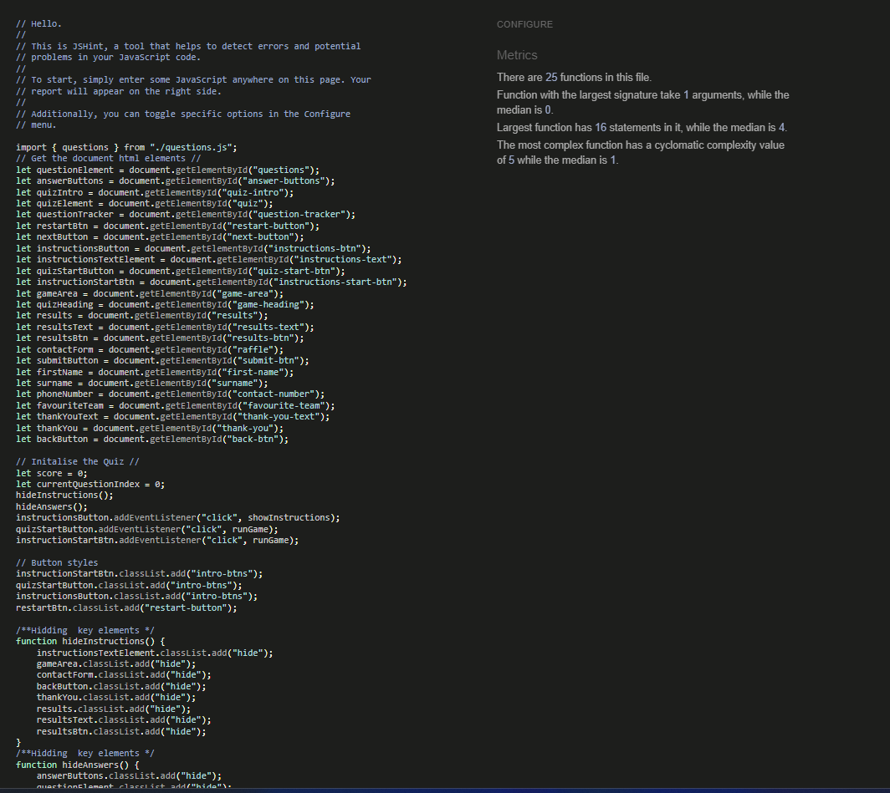

# Premier League Greatest Facts Testing

## CONTENTS

- [Premier League Greatest Facts Testing](#premier-league-greatest-facts-testing)
  - [CONTENTS](#contents)
  - [Testing Content](#testing-content)
    - [HTML Validation](#html-validation)
      - [Index validation](#index-validation)
      - [Error 404 validation](#error-404-validation)
    - [CSS Validation](#css-validation)
    - [JavaScript Validation](#javascript-validation)
    - [Solved Bugs](#solved-bugs)
    - [Known Bugs](#known-bugs)
    - [Lighthouse testing](#lighthouse-testing)
      - [Mobile Lighthouse results](#mobile-lighthouse-results)
      - [Index page Mobile Lighthouse Testing](#index-page-mobile-lighthouse-testing)
      - [Error 404 page Mobile Lighthouse Testing](#error-404-page-mobile-lighthouse-testing)
      - [Desktop Lighthouse results](#desktop-lighthouse-results)
      - [Index page Desktop Lighthouse Testing](#index-page-desktop-lighthouse-testing)
      - [Error 404 page Desktop Lighthouse Testing](#error-404-page-desktop-lighthouse-testing)
    - [Wave Report](#wave-report)
      - [Index page Wave Report](#index-page-wave-report)
      - [Error 404 page Wave Report](#error-404-page-wave-report)
    - [Manual Testing](#manual-testing)
      - [Aims](#aims)
      - [Testing steps](#testing-steps)
    - [Testing Results](#testing-results)
    - [Elements Testing](#elements-testing)

## Testing Content

### HTML Validation

#### Index validation

#### Error 404 validation

### CSS Validation

### JavaScript Validation

### Solved Bugs

- Fixed the class add issue, to fix this I created a second function called hideElements and added the hide class from the css and then added the class list add class to the show instructions function which was labelled as show changing the element from display none to display block to show the instructions.
- Fixed the issue where the footer would not stick to the bottom of the page, in order to fix this I changed the values min-height and added display flex and flex direction elements, this adjusted the main content to take up all the extra space, I also added the flex-grow property to make sure this was consistent on all screen sizes, I then added the margin-top auto style to make sure the footer stayed at the bottom of the page.
- There was an issue where the background Image would show unnessary white space when clicking the instructions button. In order to fix this I adjusted the larger padding and margin values on the instrutions window, doing this along with the fixed footer bug fix solved this issue.
- Button Elements were not centering on Tablets and Desktop screen sizes in order to fix this I added the property display flex, flex-direction column to the parent element and then used the align self element on the start and instructions button, aligning them to the center which fixed this issue.
- Fixed a bug where the instructions were visible after pressing the start button while viewing the instructions, in order to fix this I added the hide instructions function to the run game function which fixed this issue.
- Solved bugs with the quiz background this was not displaying correctly because of the height vh value removed the height value to fix this issue.
- Solved issue where there was a type error regarding the keyword question stating the value was undefined and was also trying to be used before initialisation in order to fix this initalised value outside the function declaration.
- Fixed the bug regarding duplicate answers from the runGame function in order to fix this I added a reset state function which hid the next button and used a while loop to remove the first child when it was active in the while loop.
- Fixed bug with answers not being answered correctly by changing answers.iscorrect to answers.correct which ended up the questions showing correctly.
- Fixed a bug where the questions were being repeated added new function show results with the reset state function included in this function.
- Fixed score bug which was not displaying correctly on the show results page in order to fix this I changed the template literal from questions to questions.length which got the length of the array fixing this issue.
- Fixed issue regarding correct answers when loading the quiz all questions were highlighted in green, not allowing the user to answer or go to the next question in order to fix this, I changed where the function was placed and instead placed this in the select answer function, currently this function is showing the correct answers after, I will look to refactor this function to remove this element.
- Fixed question and answer display bug by adding a curly bracket in between the for each statement and the event listener for the next button, I also removed the display correct answer part and just used button disabled instead which fixed this issue.
- Fixed issue with contact form that wasnt displaying the correct behaviour with the thankyou.html file, when pressing start the questions would not appear in order to fix this I removed the thankyou.html page and added in the event.preventDefault function to the raffle end function, which made the questions appear and removed the data from the url when submitting the form which fixed this issue.
- The data itself was not being capturned and instead was capturing the name of the html object rather than the data the user inputted, in order to fix this I added on the id name and the . value to get the data the user inputted which fixed this issue.
- Fixed an issue with raffle showing at the beginning of the quiz, to fix this I added classlist hide to the hide instructions function, added the show class to the raffle end function to fix this issue.
- Fixed an issue regarding the result screen not showing if the users score was 9 adding the less than or equal to symbol to the if statement to fix this issue.
- Fixed an HTML issue regarding the favourite team input option by removing the required attribute.
- Fixed an issue regarding the contact form by adding in the handle event function, originally the form could be submitted without filling in the correct information, which was not the original planned outcome, the handle event function fixed this by sending an alert to the user if the information hadnt been completed as required. Once all the inputs were filled out the submit button would add an event listener taking the user to the thank you message screen.
- Fixed HTML error by removing placeholder text for the favourite team select option.
- Fixed HTML error for phone input by changing label to match input id.
- Fixed HTML errors by changing section elements to div elements that do not require titles.
- Fixed CSS Header issue by aligning the footer to the left, otherwise the footer would not stay consistent with the raffle and questions aligning the footer to the left fixed this issue.
- Fixed thank you section bug, after the user pressed the go back button this would result in the run game function being loaded when the user next pressed the next button, this would instantly take the user to the form, section to fix this I added the remove event listener method removing the join raffle function from the next button and only adding this once the user has answered every question.
- Solved bug where user could click on the quiz area to reset the questions, to fix this I created a div which holds both the restart and next button element which fixed this issue.
- Changed handle form function from finding the squarebracket and the name as there was a warning from the javascript validator, Instead I used dot notation to remove these warnings.
- Fixed play again bug, after submitting the form if the user played the quiz again and pressed play again, the raffle would be shown rather than the questions, which was not the expected outcome, to fix this I removed the join raffle event listener in the raffle end function which fixed this issue.
- Fixed a bug where when replaying the quiz, the form would remain filled in rather than empty which is how the form was orginally designed, to fix this I created a function called reset form and got the forms id, I then used the .reset method, then placed this function in the startQuiz function to ensure the user was still able to submit the form.
- Fixed html input error by removing the min and max values on the type tel which fixed this issue.
- Form could be submitted without the correct accuracy in order to fix this I created a pattern for the first,surname and contact number which improved the accuracy of the form.
- Fixed form issues by creating validation functions checking if the pattern included in the html is matched by the user input, if it isnt there will be an alert sent to the user informing them of this. The handle form function then is checking if all the inputs are filled out correctly, if they are not there will be an alert sent to the user informing them of this, otherwise the submit event listener will be created allowing the user to submit the form. 
- Fixed form submission bug when the user clicked submit form when retrying the quiz the form would instantly submit in order to fix this I removed the event listener raffle end and added the function handle form which fixed this issue.
- Fixed form issue by removing validate team function as the form could be submitted without selecting a team, added to handle form function and added extra if statement to fix this issue.
- While checking the javascript in the validator there were some warnings regarding the variable raffle not being defined in order to fix this added document.forms to the logic in all validator if statements.

### Known Bugs

### Lighthouse testing 

#### Mobile Lighthouse results

#### Index page Mobile Lighthouse Testing

#### Error 404 page Mobile Lighthouse Testing

#### Desktop Lighthouse results

#### Index page Desktop Lighthouse Testing

#### Error 404 page Desktop Lighthouse Testing

### Wave Report 

#### Index page Wave Report

#### Error 404 page Wave Report

### Manual Testing 

#### Aims

* The aim is to make sure this quiz is responsive for all screen sizes without unneccesary making the user rotate their screen or scroll.
* This will be done by making sure all elements are consistent and not overlapping.
* All buttons work and questions randomise and dont repeat as intended.
* Make sure error page is deployed by github rather than githubs own error page.
* When submitting the form the form validates and stops the user, which would happen if the form submission isnt filled in or if the user is using the wrong format, once all inputs are filled in correctly, the submit button will become clickable which will send the user to a thank you page which is all on the main page index.html.

#### Testing steps

* I will test the responsiveness for all screen sizes by firstly clicking on the application and using the inspect tool to open the google chrome developer tools.
* After this I will click on the laptop display and change the aspect ration to 280px which is the lowest screen size, after this I will begin adjusting the screen sizes to make sure all elements are displaying correctly on all screen sizes.
* I will make sure all answer buttons can be clicked on only once, when the user has selected an answer I will make sure the buttons disable with the next button appearing
* I will make sure all questions are only repeated once and randomise when clicking the start, reset, or play again buttons.
* I will make sure all links open in seperate tabs not taking the user from the main page.
* I will make sure github will be finding the error page, I created rather than github displaying its own page.
* All testing will be completed using Google Chrome Internet Explorer and FireFox.

### Testing Results

**Responsiveness**|**Index**|**Error 404**
:-----:|:-----:|:-----:
Page Title|Pass|Pass
Background Image|Pass|N/a
Instructions|Pass|N/a
Instructions text|Pass|N/A
Questions|Pass|N/A
Answers|Pass|N/A
Next Button|Pass|N/A
Restart Button|Pass|N/A
Results|Pass|N/A
Raffle|Pass|N/A
Thank you section|Pass|N/A

### Elements Testing 

`Quiz intro`

`Game Area`

`Results`

`Raffle enter`

`Thank you Page`

`Error 404 page`